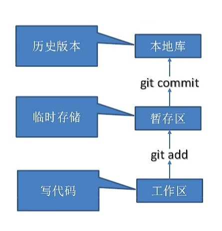
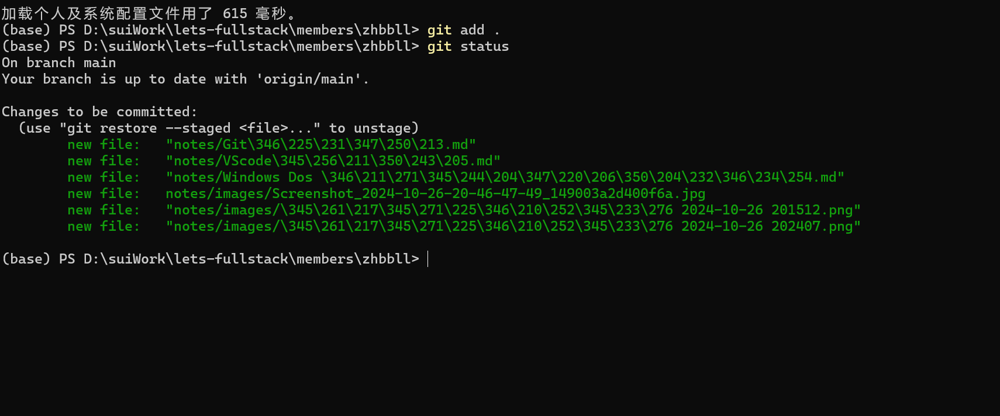
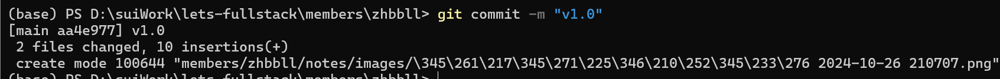
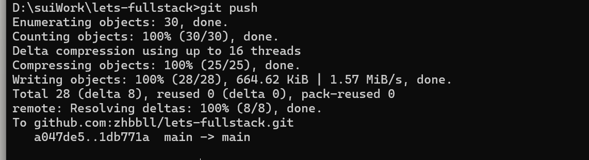
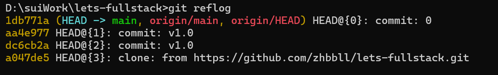

# Git教程（Windows版）

## 1 Git

### 1.1 git介绍

#### 1.1.1 分布式版本控制工具

Git是一种分布式版本控制系统，允许每个开发者在自己的本地仓库中保存项目的完整历史记录。与集中式控制系统不同，Git无需依赖于中央服务器，开发者可以独立地创建分支、进行提交，之后再与团队成员进行代码合并。这种分布式特性使得Git在脱机情况下也能继续工作，并且更具容错性。

#### 1.1.2 集中式版本控制工具

集中式版本控制工具依赖于中央服务器来保存所有的代码及历史记录，如Subversion (SVN)。开发者必须连接到服务器才能获取代码的最新版本或进行提交。显而易见的缺点是中央服务器一旦出现故障，开发者就无法提交更新。与Git相比，集中式工具在网络不稳定时操作会受限。

#### 1.1.3 git工作机制

- **工作区 **：这是我们实际进行代码编写、修改的地方，是项目的文件夹。我们在这里对文件进行编辑、创建或删除，但这些修改还没有被Git管理，也没有被记录到版本历史中。

- **暂存区：又称“索引区”或“缓存区”。当我们使用 `git add` 命令后，文件的改动会被添加到暂存区，这意味着这些改动已被Git记录，但还没有正式提交。暂存区的作用是“暂存”修改内容，方便在提交前做进一步的检查或打包。

- **本地库 **：是Git的本地数据库，用于保存所有提交的历史记录。通过 `git commit` 命令可以将暂存区的改动提交到本地库。每次提交都会形成一个独立的版本，可以随时回溯、查看或恢复。

### 1.2 git安装

1. 访问[Git官方网站](https://git-scm.com/)下载合适的版本。
2. 在安装过程中可以选择默认设置即可，这里不过多赘述。
3. 完成安装后，在终端中输入 `git --version` 验证安装是否成功。

### 1.3 git常用命令

1. **设置用户签名**：`git config --global user.name <用户名> `，`git config --global user.email <邮箱>`

2. **初始化仓库**：`git init` 初始化一个新的Git仓库。即创建一个.git目录，若是使用Clone的代码自带.git所以不需要初始化。

3. **查看状态**：`git status` 查看当前文件的修改状态。

   

4. **添加文件到暂存区**：`git add <文件名>` 将文件添加到暂存区；`git add .` 添加所有修改过的文件。

5. **提交更改**：`git commit -m "提交说明"` 提交暂存区内容并附带说明。即是提交到本地主机的仓库里面。

   

6. **推送到远程仓库**：`git push` 将本地仓库中的提交记录上传到github，使其在远程仓库（例如 github网页）中也能显示这些改动。

   

7. **查看提交历史**：`git reflog` 查看版本信息，`git log`查看更详细的版本信息。

   

8. **回退版本**：`git reset <commit>` 这条命令将 HEAD 指针移动到指定的提交（`<commit>`）。

   

9. **查看差异**：`git diff` 显示文件的改动。

10. **创建标签**：`git tag <标签名>` 创建一个标签，标记重要的提交。

11. **合并分支**：`git merge <分支名>` 将指定分支的改动合并到当前分支。

### 1.4 git分支

1. **创建分支**：`git branch <分支名>` 创建一个新分支。
2. **切换分支**：`git checkout <分支名>` 切换到指定分支。
3. **合并分支**：`git merge <分支名>` 将分支合并到当前分支。
4. **删除分支**：`git branch -d <分支名>` 删除本地分支。

## 2 github 使用教程

### 2.1 创建远程仓库
1. 登录GitHub，点击页面右上角的 **New** 按钮创建新仓库。
2. 填写仓库名称和描述，选择是否公开或私有，点击 **Create repository** 完成创建。

### 2.2 代码推送 Push
1. 使用 `git remote add origin <远程仓库地址>` 连接本地仓库和GitHub远程仓库。
2. 使用 `git push origin <分支名>` 将本地分支代码推送到GitHub。

### 2.3 代码拉取 Pull
在团队协作中需要获取最新代码时使用`git pull origin <分支名>`，此命令会同步远程仓库中的更新。

### 2.4 代码克隆 Clone
通过 `git clone <远程仓库地址>` 下载GitHub远程仓库到本地，便于后续修改和提交。

## 3 Gitee码云使用教程

### 3.1 gitee创建远程仓库

1. 登录Gitee，点击 **新建项目**。
2. 输入项目名称、选择可见性和初始化设置，完成创建。

### 3.2 gitee连接github进行代码复制和迁移
1. 在Gitee项目页面中选择 **导入已有仓库**，输入GitHub仓库的地址进行导入。
2. 可以使用Gitee的 **镜像同步** 功能，实现Gitee和GitHub之间的自动同步，确保代码在两者之间保持一致。